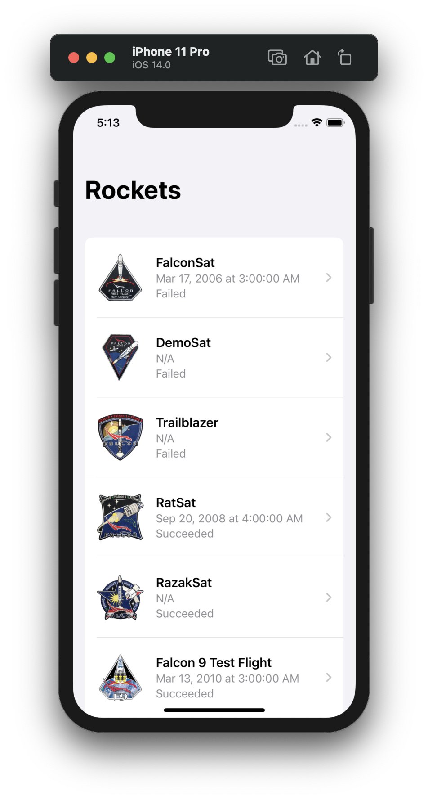
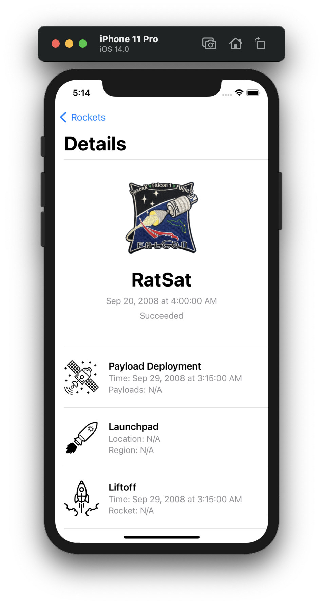

# 🚀 SpaceX
[](https://swift.org)

Test project that is based on [Matteo Manferdini](https://github.com/matteom) tutorial - [Launches](https://matteomanferdini.com/codable/) on advanced use of the Codable protocol.

I thoroughly disassembled each line of the sample project and rewrote, partially made it my own way. While I was studying this project, several thoughts appeared, what else could I try, maybe in the future I will come back to this and implement my plan.

Many thanks to Matteo for a well-written article 👍

  <p float="right">
  
  
  </p>
  

## 🏃‍♂️ Getting Started

``` bash
git clone https://github.com/johnnieWa1ker/SpaceX.git
cd SpaceX
pod install
open SpaceX.xcodeproj
```

## 🎉 Why am I building this?
1. I am very interested in the SwiftUI framework from Apple, I believe that after a while it will become quite powerful so that you can quickly make cool projects with it
1. At some point, I realized that I was superficially familiar with the Codable protocol and decided to restore it to memory, and at the same time practice a little 🤓

### 😇 P.S
I do not like it when icons are missing even in test applications, so I took the image I liked from the Internet, it turned out to be the work of [Kyle Lamond](https://www.behance.net/KyleLamond), I hope you will not mind) By the way, I really liked your [project](https://www.behance.net/gallery/65670521/SpaceX-2018-Rebrand) on Behance
